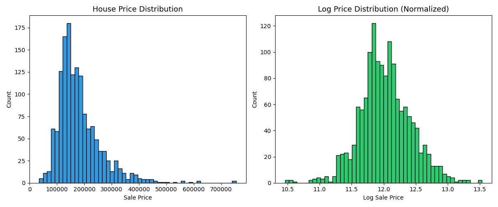
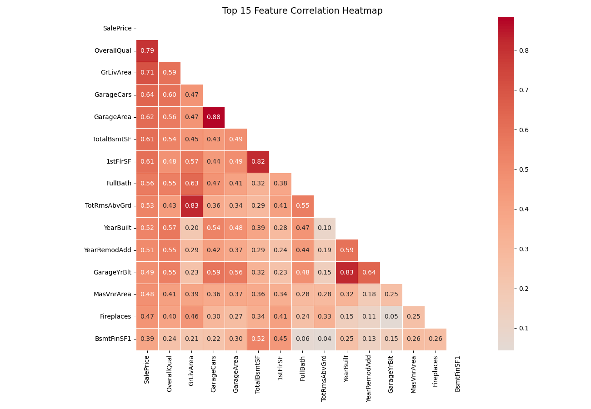
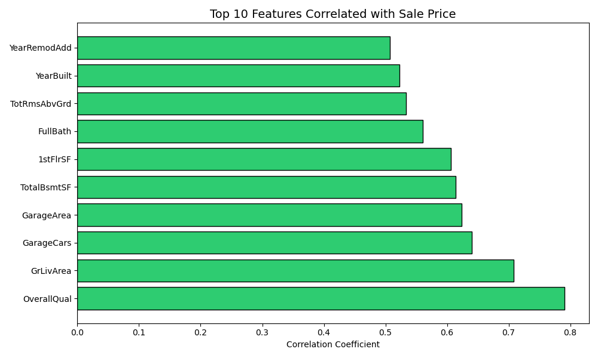
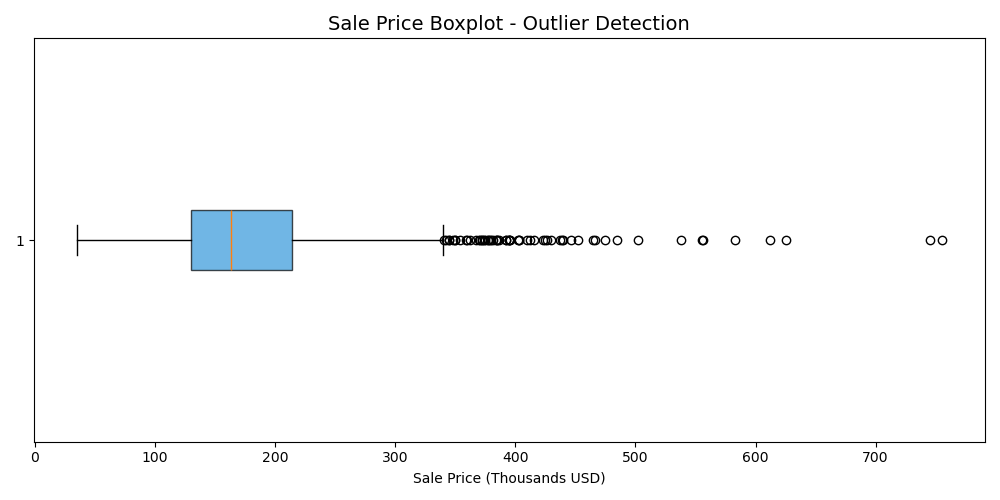

# Advanced House Price EDA 🏠

Deep exploratory data analysis on 21,000+ house sales
using correlation analysis, outlier detection and distribution plots.

## Tools Used
- Python, Pandas, NumPy, Matplotlib, Seaborn

## Analysis Performed
- Price distribution and log normalization
- Full feature correlation heatmap
- Top features correlated with price
- Living area vs price relationship
- Average price by number of bedrooms
- Outlier detection using IQR method
- Waterfront vs non-waterfront price comparison

## Key Findings
- sqft_living is the strongest predictor of price
- Waterfront properties cost significantly more
- Price distribution is right-skewed (log transform helps)
- 1,147 outlier properties detected via IQR method

## Charts

